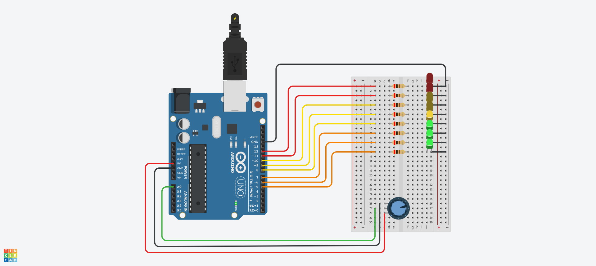

# Projeto de Controle de LEDs com Potenciômetro :bulb:

Este repositório contém um projeto simples de Arduino que controla LEDs com base na leitura de um potenciômetro. O código faz uso das saídas digitais do Arduino para acender os LEDs progressivamente à medida que o valor do potenciômetro aumenta.

## Circuito :electric_plug:

Você pode visualizar e interagir com o circuito no 

## Instalação :gear:

1. Carregue o código do projeto para o seu Arduino.
2. Monte o circuito conforme a imagem fornecida.
3. Conecte o potenciômetro ao pino A0 do Arduino.
4. Ligue o Arduino.

## Uso :rocket:

Ajuste o potenciômetro para controlar os LEDs. Quanto maior o valor lido pelo potenciômetro, mais LEDs serão acesos.

Sinta-se à vontade para explorar e dar dicas para este projeto!

